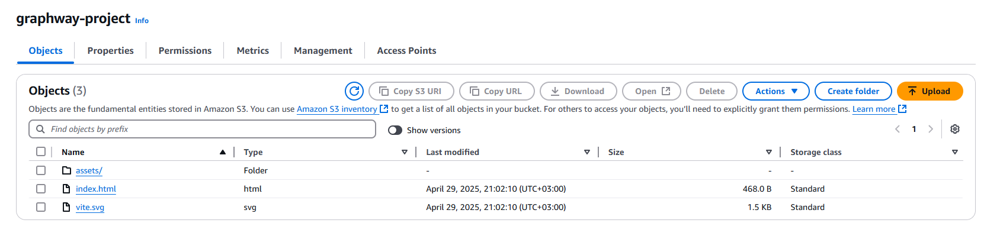

# React + Vite

This template provides a minimal setup to get React working in Vite with HMR and some ESLint rules.

Currently, two official plugins are available:

- [@vitejs/plugin-react](https://github.com/vitejs/vite-plugin-react/blob/main/packages/plugin-react) uses [Babel](https://babeljs.io/) for Fast Refresh
- [@vitejs/plugin-react-swc](https://github.com/vitejs/vite-plugin-react/blob/main/packages/plugin-react-swc) uses [SWC](https://swc.rs/) for Fast Refresh

## Expanding the ESLint configuration

If you are developing a production application, we recommend using TypeScript with type-aware lint rules enabled. Check out the [TS template](https://github.com/vitejs/vite/tree/main/packages/create-vite/template-react-ts) for information on how to integrate TypeScript and [`typescript-eslint`](https://typescript-eslint.io) in your project.

Application is accessible by this link: http://graphway-project.s3-website.eu-north-1.amazonaws.com/
It's deployed on AWS S3 bucket. 

## How to deploy new changes in prod (AWS S3)

To deploy new change you need to:
1. Checkout main branch and pull latest changes
2. Run `npm run build`, it will build /dist directory with `index.html` file in it.
3. Log into AWS Console. Go into Amazon S3 -> Buckets -> graphway-project -> Copy all the content of /dist folder that you build on previous step. It should looks like this: 

4. If something goes wrong, it's possible to rollback to previous version. This S3 bucket has versioning enabled.
